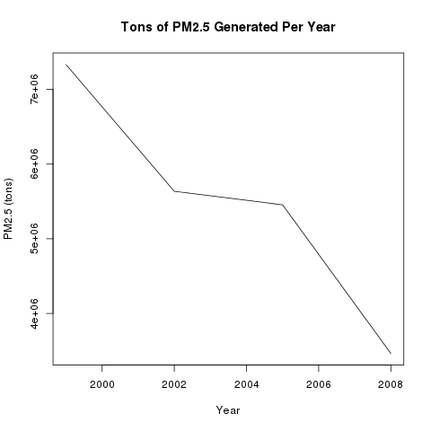
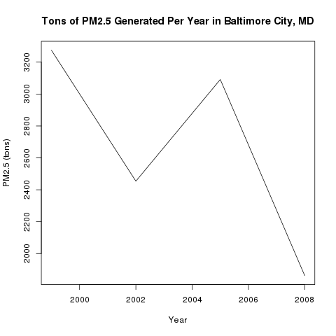
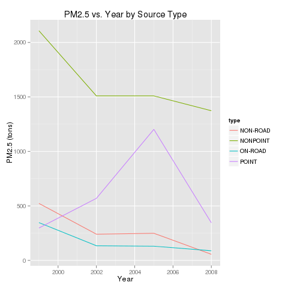
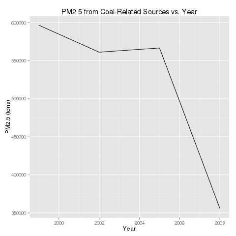
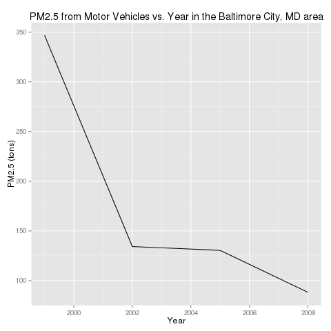
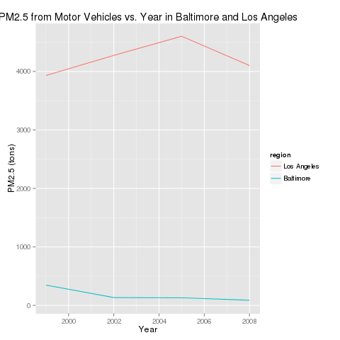

Exploratory Data Analysis Project 2 Summary
===========================================

**Plot 1**

[plot1.R](plot1.R)

**Plot 2**

[plot2.R](plot2.R)

**Plot3**

[plot3.R](plot3.R)

**Plot 4**

[plot4.R](plot4.R)

**Plot 4**

[plot4.R](plot4.R)

**Plot 5**

[plot5.R](plot5.R)

**Plot 6**

[plot6.R](plot6.R)

